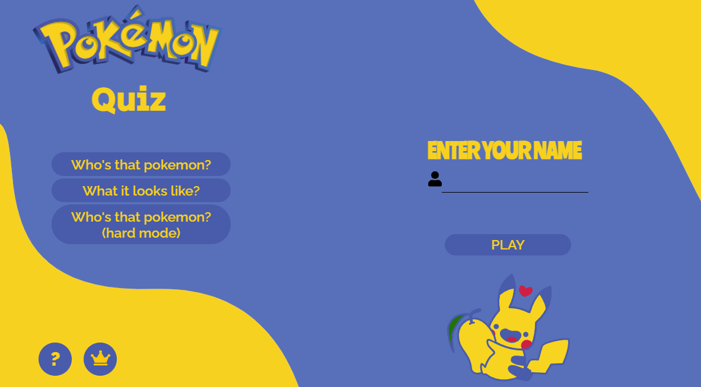
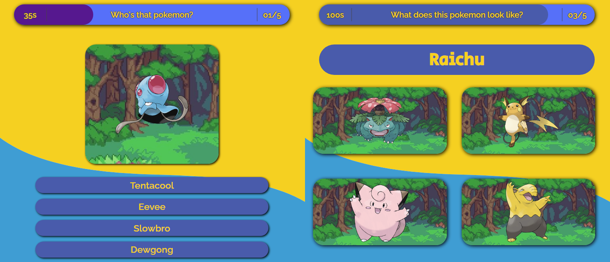

# CodersCamp 2020 - Projekt JavaScript
## Pokemon Quiz
Projekt wykorzystuje asynchronicznego JavaScript oraz korzysta z REST API.

### Zespół projektowy
Mentor:
[Łukasz Dutka](https://github.com/lukaszdutka)

Uczestnicy:
* [Kamil Arendarczyk](https://github.com/arendarczyk) (UX Designer)
* [Aleksandra Cypko](https://github.com/AleksandraCyp) (Tech Lead)
* [Małgorzata Dziewit](https://github.com/memeraki)
* [Daria Dziubałtowska](https://github.com/daria305) (Product Owner)
* [Agata Ludwiczyńska](https://github.com/AgataLudwiczynska)
* [Mariusz Smarż](https://github.com/mariusz-sm) (Develepment Manager)

**[Live - działająca aplikacja - zagraj i sprawdź czy dobrze znasz Pokemony :)](https://lukaszdutka.github.io/CodersCamp2020.Project.JavaScript.pokemonquiz/)**

Aplikacja została stworzona w oparcui o czysty JavaScript. Nie korzysta z żadnych frameworków oraz bibliotek styli. 

### Wykorzystane technologie:
- JavaScript
- HTML
- CSS
- Pokémon API

### Narzędzia z jakimi pracowaliśmy:
- Visual Studio Code
- GitHub Desktop

**Pokemon Quiz** wzorowany był na **Quiz Star Wars** udostępnionym przez **CodersCamp**.
Projekt jest ukończony.

#### Wymagania funkcjonalne

1. Tryb quizu (zawierać pokemony z pierwszej generacji):
    - Podane jest zdjęcie pokemona, gracz zaznacza nazwę – 4 opcje
        - Modyfikacja - Trudniejsza wersja – zdjęcie ukazuje tylko kształt pokemona
    - Podana jest nazwa pokemona, gracz ma za zadanie zaznaczyć prawidłowe zdjęcie. 
2. Zasady dostępne w osobnym oknie, po naciśnięciu pojawią się zasady gry dla wszystkich trybów na raz.
3. Zasady dla danego trybu:
    - 2-3 zdania wyjaśnienia dla poszczególnego trybu
4. Gracz podaje imię przed rozpoczęciem gry, na ekranie startowym. 
    - Dopiero po podaniu imienia ma możliwość kliknięcia na `start` – rozpoczęcia gry. 
    - Pole cały czas dostępne do edycji, zmiana imienia powinna być bezproblemowa i niezależna od wybranego trybu gry.
5. Po rozpoczęciu gry rozpoczyna się odliczanie czasu (2 minuty).
    - Czas nie jest ograniczony dla pojedynczych pytań.
    - Jest ograniczona maksymalna liczba pytań - 30 (Aby uniknąć sytuacji w której gracz mógłby szybko przeklikać pytania z tą samą odpowiedzią i statystycznie otrzymałby 25% dobrych odpowiedzi, w łatwy sposób pokonując uczciwych graczy.
    - W przypadku tej samej liczby punktów w rankingu brany jest pod uwagę czas ukończenia quizu.
6. W trakcie trwania quizu ukazywany jest czas pozostały do końca quizu.
7. Wybór odpowiedzi przez gracza.
    - Kliknięcia na odpowiedź od razu powoduje jej zaznaczenie i udzielenie odpowiedzi.
    - Po najechaniu na cały guzik/odpowiedź ma się on uwypuklać/podświetlać.
8. Pod koniec podsumowanie pytań – użytkownik może sprawdzić swoje odpowiedzi
    - Informacja personalizowana imieniem jakie podał gracz.
    - Zdjęcie pikachu (opcjonalne).
9. Generowanie pytań
    - Pytania muszą być zabezpieczone przed powtarzaniem się, gracz nie może wylosować ponownie tego samego pytania.
    - Zostaje pobrany losowy zasób z danego trybu.
    - Zostanie pobrane dla wylosowanego zasobu zdjęcie.
    - Losowane są 3 pozostałe nieprawidłowe odpowiedzi z zapytania do Pokemon API.
10. Po ukończeniu czasu wynik gracza zapisywany jest w rankingu dla danej przeglądarki (LocalStorage).
    - Osobne podsumowania dla trybów.
    - Pokazywany jest ranking 3 najlepszych wyników.
11. Brak opcji SETTINGS

# **Pokemon Gotta Catch ’Em All!**